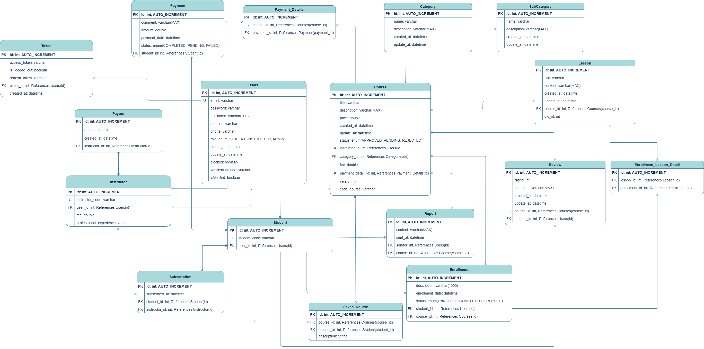

# Online Course Management API

This Online Course Management API, built with Java Spring Boot, provides a comprehensive system for managing user accounts, courses, instructors, students, and administrators. It supports a wide range of features including user registration, secure JWT-based authentication, course enrollment, lesson access, course submissions and resubmissions, course reporting, evaluations, subscription management, and seamless VNPay payment integration.

## Features

- **User Management**: Manage user accounts, including instructors, students, and administrators.
- **Course Management**: Handle course creation, updating, and assignment to instructors and students.
- **Authentication**: Implement JWT for secure user authentication and authorization.
- **Course Enrollment**: Allow students to enroll in courses and manage their course enrollments.
- **Lesson Access**: Students can access and complete lessons within a course.
- **Course Submission & Resubmission**: Students can submit and resubmit their work for evaluation.
- **Course Reporting**: Generate and view reports on course progress and performance.
- **Course Evaluation**: Allow students to evaluate courses and provide feedback.
- **Course Subscription**: Manage subscription-based access to courses.
- **Payment Integration**: Integrate VNPay e-wallet for payment processing.
- **Unit Testing**: Comprehensive unit tests to ensure code quality.

## Technologies Used

- **Java 21**
- **Spring Boot**
- **Spring Security**
- **JWT**
- **JPA & Hibernate (ORM)**
- **PostgreSQL (SQL Database)**

## Database Schema

## Prerequisites

- Java 21
- PostgreSQL
